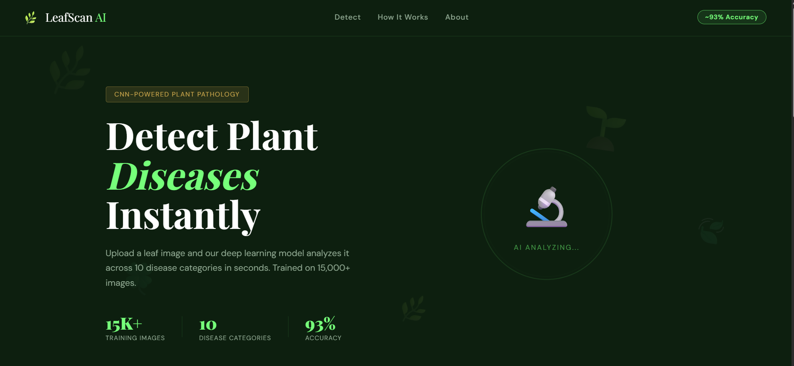
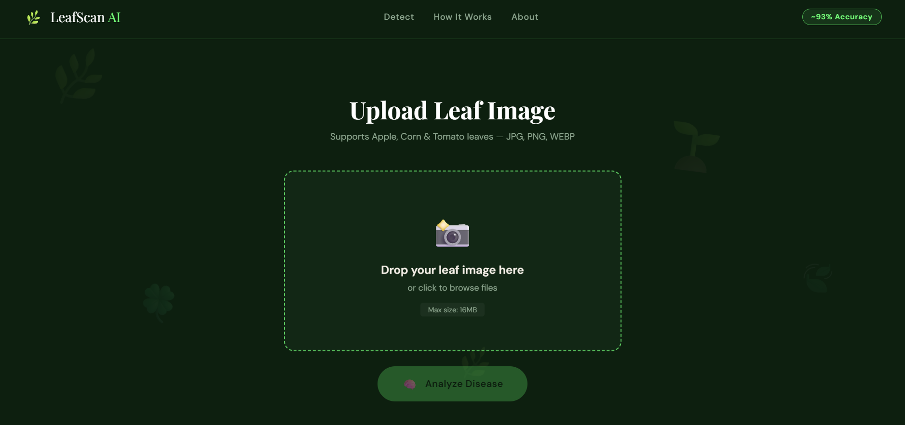
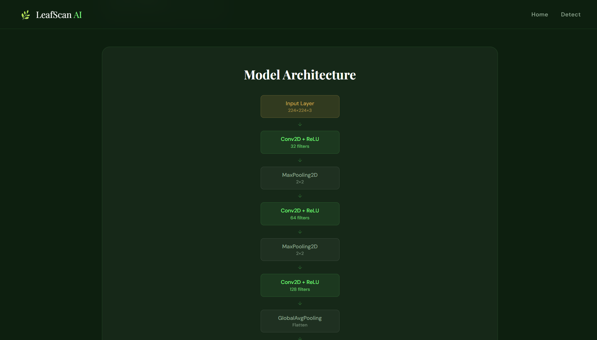

# 🌿 Plant Disease Detection using CNN

## 📌 Project Overview

Plant Disease Detection is a Deep Learning-based web application that identifies plant leaf diseases from uploaded images. The system uses a Convolutional Neural Network (CNN) model trained on a large dataset of plant leaf images to provide accurate and real-time disease predictions, helping farmers and agricultural researchers detect diseases at an early stage.

<h2>📸 Project Screenshots</h2>








## 🚀 Features

* 🌱 Detects plant diseases from leaf images
* 🤖 CNN-based Deep Learning model
* 📈 Achieved approximately **93% accuracy**
* 🖼️ Real-time image upload and prediction
* 🔄 Data augmentation for improved model performance
* 🌐 User-friendly Flask web interface
* ⚡ Fast and accurate disease classification

## 🛠️ Technologies Used

* Python
* TensorFlow
* Keras
* OpenCV
* Flask
* HTML, CSS, JavaScript

## 📂 Dataset

* Dataset Size: **15,000+ images**
* Categories: **10 Plant Disease Classes**
* Applied image preprocessing and augmentation techniques:

  * Rotation
  * Flipping
  * Zooming
  * Rescaling

## 🧠 Model Architecture

The project uses a Convolutional Neural Network (CNN) consisting of:

* Convolution Layers
* Max Pooling Layers
* Dropout Layers
* Fully Connected Dense Layers
* Softmax Output Layer

## 📊 Model Performance

| Metric       | Value                 |
| ------------ | --------------------- |
| Accuracy     | ~93%                  |
| Dataset Size | 15,000+ Images        |
| Classes      | 10 Disease Categories |

## 📸 Application Workflow

1. User uploads a plant leaf image.
2. Image is preprocessed using OpenCV.
3. CNN model analyzes the image.
4. Disease prediction is generated.
5. Result is displayed through the Flask web interface.

## 📁 Project Structure

```bash
Plant-Disease-Detection/
│
├── static/
├── templates/
├── model/
│   └── plant_disease_model.h5
├── dataset/
├── app.py
├── train_model.py
├── requirements.txt
└── README.md
```

## ⚙️ Installation

### Clone Repository

```bash
git clone https://github.com/your-username/Plant-Disease-Detection.git
cd Plant-Disease-Detection
```

### Install Dependencies

```bash
pip install -r requirements.txt
```

### Run Application

```bash
python app.py
```

Open your browser and visit:

```bash
http://127.0.0.1:5000
```

## 🎯 Future Improvements

* Support for more plant species
* Mobile application integration
* Disease treatment recommendations
* Cloud deployment using AWS/Azure
* Multi-language support

## 🤝 Contributing

Contributions are welcome! Feel free to fork the repository and submit pull requests.

## 📜 License

This project is licensed under the MIT License.

## 👨‍💻 Author

**Chandan Gond**

B.Tech CSE (AI & ML)

Aspiring Software Engineer | AI & Machine Learning Enthusiast
Software Engineer | Java Developer | Python Developer | Network Security Engineer | Spring Boot | SQL | Open to Internship & Full-Time Opportunities

## 🚧 Project Status

This project is currently under development.

### Current Progress

* ✅ Dataset collection completed
* ✅ Data preprocessing and augmentation completed
* ✅ CNN architecture designed
* ✅ Flask web interface created
* 🔄 Model training in progress
* 🔄 Performance evaluation pending
* 🔄 Deployment in progress

### Planned Features

* Plant disease classification using CNN
* Real-time image upload and prediction
* Disease information and recommendations
* Web-based dashboard using Flask

**Note:** Model training is currently in progress. Accuracy and performance metrics will be updated after successful training and evaluation.

